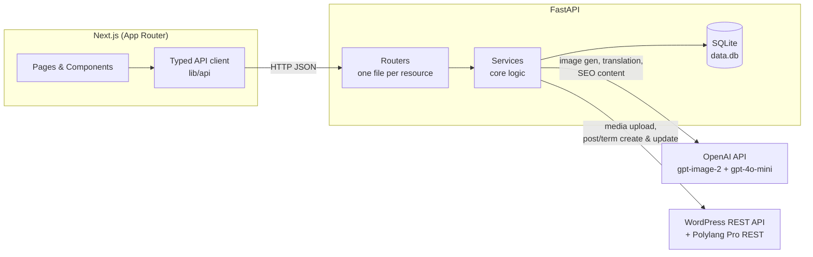
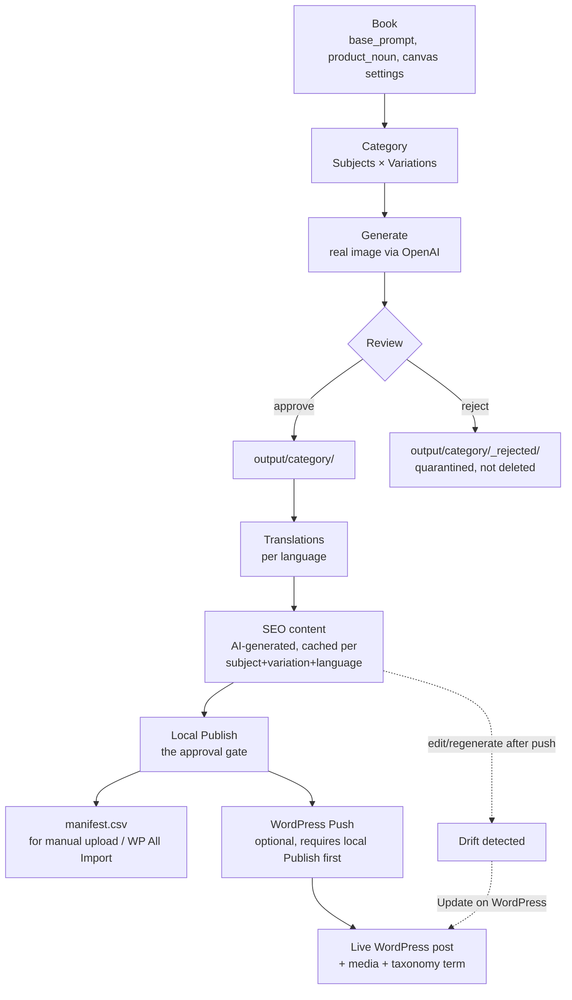
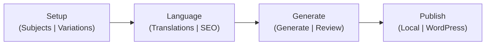

# Architecture Overview

## System shape

Two servers, run separately in development (`uvicorn` on :8000,
`next dev` on :3000). No shared process, no message queue — the frontend
talks to the backend exclusively over HTTP, using a typed client
(`frontend/lib/api/`) that mirrors the backend's Pydantic schemas by
hand (there is no code generation step; if a backend response shape
changes, the matching frontend interface must be updated manually — this
has been a repeated source of bugs, see `decision-log.md`).

## The content pipeline, end to end

The two branches out of local Publish (`manifest.csv` and WordPress Push)
are deliberately independent and equally complete — the manifest is not a
stripped-down fallback, it carries the same real SEO content as the
automated push. See `generation-publishing.md` for why this matters.

## Where each concern lives

| Concern | Backend location | Frontend location |
|---|---|---|
| Book/Category CRUD | `routers/books.py`, `routers/categories.py` | `app/books/`, `app/categories/[name]/` |
| Image generation | `routers/generation.py`, `services/generation.py` | `components/GeneratePanel.tsx` |
| Review (reject/restore) | `routers/review.py`, `services/review.py` | `components/ReviewPanel.tsx` |
| Translation | `routers/translations.py`, `services/translate.py` | `components/TranslationsPanel.tsx` |
| SEO content | `routers/seo.py`, `services/content_variants.py` | `components/SeoPanel.tsx` |
| Local Publish | `routers/publish.py`, `services/publish.py` | `components/PublishPanel.tsx` |
| WordPress push | `routers/wordpress.py`, `services/wordpress_publish.py` | `components/WordPressPushPanel.tsx` |
| Account/global settings | `routers/account_settings.py`, `routers/settings.py` | `app/settings/page.tsx` |

## Why Books exist as a layer above Categories

Not present in the original version of this project — Categories used to
own their own prompt directly. Books were introduced when it became clear
that multiple categories (e.g. "Vehicles," "Animals," "Dinosaurs") often
share one style/prompt, and that style is a genuinely separate concern
from "what subjects exist." A Book is that shared style: prompt, product
type, and image-processing settings, inherited by every Category placed
inside it. See `decision-log.md` for the migration this required.

## The category detail page's structure

The category page is organized into four collapsible, tabbed sections
(`TabbedSection` component), reduced from an earlier eight-flat-section
layout once the SEO section was added and the page started feeling
overloaded:

This ordering intentionally matches the real workflow order a user
follows when building out a category from scratch.
